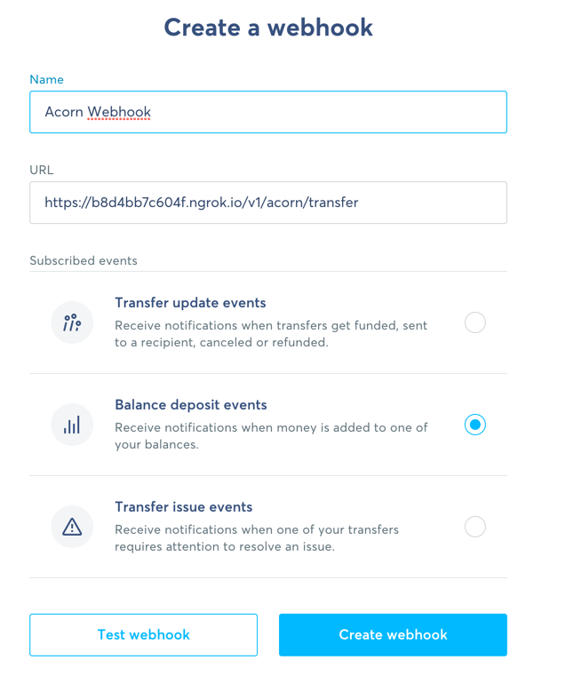

# Acorn
A fun script to apply custom ruleset to store money in jars every time you receive money

Use this at your own risk. It was developed within a few hours during our mission days and doesn't meet the normal quality standards that we uphold at wise, for example, it has no tests. We felt it could be a useful starting point for people to play around with Wise APIs, rather than being used as a standalone.

# How it works

We listen to a webhook on balance deposits into an account, then we create or find a specific jar. Then looking at incoming deposits, we apply rules to understand if and how they should be moved to the jars. We then call the `/balance-movements` API to move this money between balances.

## Pre-requisites

Make sure you have java 15 and docker installed.

## How to run locally?

1.  Create your account on https://ngrok.com and copy paste your ngrok token to `ngrok-exec/ngrok.conf`. (Only use ngrok if you don't want to set up a public https server that can handle incoming webhooks on its own)
2.  Go to `src/java/resources/application.yml` to edit your ruleset. Each currency can have specific threshold, and there's also a default ruleset. For a transfer from your balance to your jar to be triggered, the amount received must between the min and max value for the balance currency, and the amount of money to be transferred will be equal to the percentage defined in that same rule set multiplied by the received amount. In the absence of a currency specific ruleset, the default ruleset will apply as defined in `wise.ruleset.default`.
3.  Go to wise.com/settings, get a personal token with full access and add it to the environment variable "WISE_TOKEN"
    NB: you need to keep this token secret. It will have full access to your account through the API.
4.  Now go to the root of this repository and run `bash start.bash`, this will package up the application in a docker container and run it alongside an ngrok container.
4. The console will now show tons of logs, including the ngrok url from the ngrok container. Copy the one that starts with https to your clipboard.
   
5. Go to wise.com, login, then settings > webhooks. Choose deposit events and use the ngrok https url and then append `/balance-deposits` to it.
6. You're all set, enjoy!

