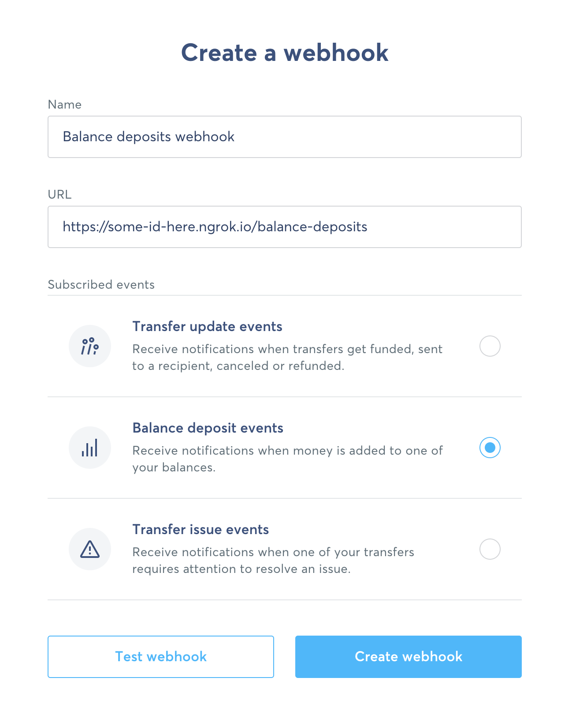

# Acorn

Your local microservice to apply custom ruleset to store money in jars everytime you receive money

## Pre-requisite

Make sure you have java 15 and docker installed.

## How to run locally?

1.  Create your account on https://ngrok.com and copy paste your ngrok token to `ngrok-exec/ngrok.conf`.
2.  Go to `src/java/resources/application.yml` edit the values here:
   - find your oauth token in your wise account and add it to `wise.oauth-token` parameter.
   - edit your ruleset. Each currency can have specific threshold, and there's also a default ruleset. For a transfer from your balance to your jar to be triggered, the amount received must between the min and max value for the balance currency, and the amount of money to be transferred will be equal to the percentage defined in that same rule set multiplied by the received amount. In the absence of a currency specific ruleset, the default ruleset will apply as defined in `wise.ruleset.default`.
3.  Now go to the root of this repository, and Run the following commands
   - `./gradlew bootJar`
   - `./gradlew docker`
   - `cd docker`
   - `docker-compose up`
4. The console will now show up some ngrok url from the ngrok customer. Copy it to your clipboard (the https one).
   
5. Go to wise.com, login, then settings > webhooks. Choose deposit events and use the ngrok https url and then append `/balance-deposits` to it.
6. You're all set, enjoy!

